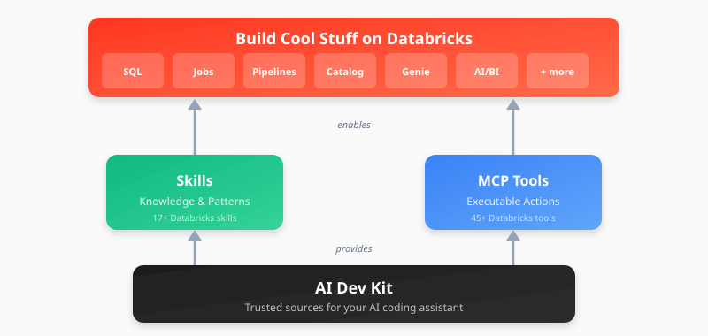

# Databricks AI Dev Kit

<p align="center">
  
</p>

---
> 📣 **A big step forward: AI Dev Kit skills are now official Databricks AI Tools**
>
> The skills from this AI Dev Kit repository are now delivered as part of  **Databricks AI Tools**, 
> a Databricks **engineering-owned repository**, built and maintained in close collaboration 
> with field engineering.
>
> **Databricks AI Tools**
> are installed and kept up to date directly through the **Databricks CLI**
> (`databricks aitools install`), or through the AI Dev Kit installer, which delegates to the CLI and
> still guides you through the process.
>
> **AI Tools work with any agent** and include a
> first-class **Genie One** integration.
---

**Already installed?** Re-run the [Quick Start (install)](#install-in-existing-project) in this repo to uninstall older skills and the MCP 
server before installing the official AI Tools — see [Where Skills Come From](#where-skills-come-from). 

**What stays:** The MCP server and Builder App remain in this repository. The Builder App will keep
being developed and improved, and the MCP server will be maintained and updated on a best-effort
basis as GitHub issues are filed.

**What's next:** AI Dev Kit will continue to guide you through setting up your AI coding environment
and be a place to find experimental tools developed by Field Engineering. We're working on several
tutorials to help you get started using coding agents for building on Databricks — including getting
started with Genie Code and Omnigent — which will land in a future update. The bundled skill files 
in this repo are deprecated and kept for reference only.

**A few skills were renamed or merged** in the official install. Most names are unchanged; the
exceptions are:

| Previously (AI Dev Kit) | Official Databricks skills |
|---|---|
| `databricks-bundles` | `databricks-dabs` |
| `databricks-genie` | `databricks-genie-agents` |
| `databricks-spark-declarative-pipelines` | `databricks-pipelines` |
| `databricks-lakebase-autoscale`, `databricks-lakebase-provisioned` | `databricks-lakebase` (merged) |
| `databricks-config` | `databricks-core` (merged) |

> 🔒 Proactive Dependency Security  
> As part of our commitment to supply chain integrity, we continually monitor our dependency tree against known vulnerabilities and industry advisories. In response to a recently disclosed supply chain incident affecting litellm versions 1.82.7–1.82.8, we have audited our packages and removed the litellm dependency for most usage. It is solely used in the test directory for skills evaluation and optimization, and has been pinned to a safe version.  
> For full third-party attribution, see NOTICE.txt.
---

## Install or Upgrade

| Options                          | Best For | Start Here |
|----------------------------------|----------|------------|
| :star: [**Install Skills**](#install-in-existing-project) | **Start here!** Follow quick install instructions to add Databricks skills for your user or existing project folder | [Quick Start (install)](#install-in-existing-project)
| [**Genie Code Skills**](databricks-skills/) | Upload selected skills into your workspace for Genie Code. Note: much of the content in the public Databricks skills is already included in Genie Code. | [Genie Code skills (install)](#genie-code-skills) |
| [**Visual Builder App**](#visual-builder-app) | Web-based UI for Databricks development | `databricks-builder-app/` |
| [**MCP Tools**](databricks-mcp-server/) | Standalone MCP server exposing Databricks actions to AI clients. Note: We recommend skills instead, but maintain this as a good foundation if a custom MCP server is required. | [Register MCP server](databricks-mcp-server/) |
---

## AI-Assisted Development on Databricks

Databricks offers two paths for AI-assisted coding. Choose the one that matches your environment.

<table>
<tr>
<td width="50%" align="center" valign="top">

<br>


<br><br>

**Free, first-party AI coding inside Databricks**

Built into every Databricks workspace with deep native product context — your notebooks, jobs, and Unity Catalog data are already in scope. Ideal for users who have not started using AI-driven development tools or that are comfortable in Databricks workspace.

</td>
<td width="50%" align="center" valign="top">

<br>


<br><br>

**Databricks expertise, in the editor you already use**

Curated by Databricks field experts. Brings tutorials, patterns, and the official Databricks agent skills to your AI coding tools to build on Databricks — wherever you're already coding.

<br>


<br>
<sub>+ Antigravity · Windsurf · OpenCode · and more!</sub>

</td>
</tr>
<tr>
<td align="center">

<a href="https://docs.databricks.com/aws/en/genie-code/"></a>

<br>

</td>
<td align="center">

<a href="#install-in-existing-project"></a>

<br>

</td>
</tr>
</table>

---

## What Can I Build?

- **Spark Declarative Pipelines** (streaming tables, CDC, SCD Type 2, Auto Loader)
- **Databricks Jobs** (scheduled workflows, multi-task DAGs)
- **AI/BI Dashboards** (visualizations, KPIs, analytics)
- **Unity Catalog** (tables, volumes, governance)
- **Genie Spaces** (natural language data exploration)
- **Knowledge Assistants** (RAG-based document Q&A)
- **MLflow Experiments** (evaluation, scoring, traces)
- **Model Serving** (deploy ML models and AI agents to endpoints)
- **Databricks Apps** (full-stack web applications with foundation model integration)
- ...and more

> **Building a Databricks App?** The `databricks-apps-python` skill defaults to AppKit (TypeScript + React) — the recommended path for most Apps use cases — and falls back to the Python frameworks (Dash, Streamlit, Flask, FastAPI, Gradio, Reflex) when you need a specific one. If you specifically need the APX (FastAPI + React) framework, that skill now lives in the [databricks-solutions/apx](https://github.com/databricks-solutions/apx) repo.

---

## Quick Start

### Prerequisites

- [Databricks CLI](https://docs.databricks.com/aws/en/dev-tools/cli/) **v1.0.0+** - Command line interface for Databricks (v1.0.0+ ships `databricks aitools`, which installs most skills)
- AI coding environment (one or more):
  - [Claude Code](https://claude.ai/code)
  - [Cursor](https://cursor.com)
  - [Gemini CLI](https://github.com/google-gemini/gemini-cli)
  - [Antigravity](https://antigravity.google)
  - [Codex](https://openai.com/codex/)
  - [Copilot](https://github.com/features/copilot/cli)
  - [Windsurf](https://windsurf.com)
  - [OpenCode](https://opencode.ai)
  - [Kiro](https://kiro.dev)


### Install in existing project
By default this will install at a project level rather than a user level. This is often a good fit, but requires you to run your client from the exact directory that was used for the install. You can install for your user across all projects on the machine by passing `--global` or setting the scope to global in the interactive install.
_Note: Project configuration files can be found under these folder: .claude, .cursor, .gemini, .codex, .github, .agents, .windsurf, .codeium, .opencode, .kiro, or opencode.json_

#### Mac / Linux

**Basic installation** (uses DEFAULT profile, project scope)

```bash
bash <(curl -sL https://raw.githubusercontent.com/databricks-solutions/ai-dev-kit/main/install.sh)
```

<details>
<summary><strong>Advanced Options</strong> (click to expand)</summary>

**Global installation with force reinstall**

```bash
bash <(curl -sL https://raw.githubusercontent.com/databricks-solutions/ai-dev-kit/main/install.sh) --global --force
```

**Install specific skills only**

```bash
bash <(curl -sL https://raw.githubusercontent.com/databricks-solutions/ai-dev-kit/main/install.sh) --skills databricks-core,databricks-bundles,databricks-pipelines
```

</details>

**Next steps:** Respond to interactive prompts and follow the on-screen instructions.
- Note: Cursor and Copilot require updating settings manually after install.

#### Windows (PowerShell)

**Basic installation** (uses DEFAULT profile, project scope)

```powershell
irm https://raw.githubusercontent.com/databricks-solutions/ai-dev-kit/main/install.ps1 | iex
```

<details>
<summary><strong>Advanced Options</strong> (click to expand)</summary>

**Download script first**

```powershell
irm https://raw.githubusercontent.com/databricks-solutions/ai-dev-kit/main/install.ps1 -OutFile install.ps1
```

**Global installation with force reinstall**

```powershell
.\install.ps1 -Global -Force
```

**Install for specific tools only**

```powershell
.\install.ps1 -Tools cursor,gemini,antigravity
```

</details>

**Next steps:** Respond to interactive prompts and follow the on-screen instructions.
- Note: Cursor and Copilot require updating settings manually after install.

### Where Skills Come From

Most skills are delivered as **Databricks AI Tools** through the Databricks CLI. The installer assembles them
from two upstream sources — nothing is bundled in this repo anymore:

| Source | Skills | Mechanism |
|--------|--------|-----------|
| [databricks/databricks-agent-skills](https://github.com/databricks/databricks-agent-skills) | Most Databricks skills (jobs, pipelines, DABs, SQL, Unity Catalog, apps, Genie, …) | Delegated to `databricks aitools install` — requires **Databricks CLI v1.0.0+** |
| [mlflow/skills](https://github.com/mlflow/skills) | MLflow skills | Fetched from `main` (override with `MLFLOW_REF`) |

Skills installed via `databricks aitools` are managed by the CLI afterwards — update them with `databricks aitools update` and remove them with `databricks aitools uninstall`. For tools the CLI can't target yet (Gemini CLI, Windsurf, Kiro), the installer installs the same skills into each tool's skills directory.

Use `--list-skills` to see every skill and profile, and `--dry-run` to preview exactly what an install would do (resolved refs and the `aitools` command) without changing anything. Some skills were renamed or consolidated in the move — see [Breaking change: skill sources and names](#breaking-change-skill-sources-and-names) below.

<details>
<summary><strong>Installer environment variables</strong> (click to expand)</summary>

| Variable | Default | Purpose |
|----------|---------|---------|
| `MLFLOW_REF` | `main` | Ref for the MLflow skills fetch (the repo is tagless) |
| `INCLUDE_PRERELEASES` | `0` | Set to `1` to allow `-rc`/`-beta` tags when resolving `latest` |
| `DRY_RUN` | `false` | Set to `1` to print the install plan and exit |

The installer also records what it installed (resolved refs, commit SHAs, `aitools` release) in `skills.lock` inside the scope-local `.ai-dev-kit/` state directory.

</details>

### Update

Re-run the same install command; it detects the existing install and updates it in place.

```bash
bash <(curl -sL https://raw.githubusercontent.com/databricks-solutions/ai-dev-kit/main/install.sh)
```

<details>
<summary><strong>Windows (PowerShell)</strong></summary>

```powershell
irm https://raw.githubusercontent.com/databricks-solutions/ai-dev-kit/main/install.ps1 | iex
```

</details>

### Uninstall

Run the same script with `--uninstall`. It removes the installed skill folders (including ones from older versions), the MCP server runtime (`~/.ai-dev-kit`), and the `databricks` MCP entry from each editor's config — leaving your other MCP servers, skills, and settings untouched. Editor config files are backed up to `<file>.bak` first.

```bash
# Preview what would be removed (changes nothing)
bash <(curl -sL https://raw.githubusercontent.com/databricks-solutions/ai-dev-kit/main/install.sh) --uninstall --dry-run

# Uninstall the project-scope install in the current directory
bash <(curl -sL https://raw.githubusercontent.com/databricks-solutions/ai-dev-kit/main/install.sh) --uninstall

# Uninstall a global install (add -y to skip the confirmation prompt)
bash <(curl -sL https://raw.githubusercontent.com/databricks-solutions/ai-dev-kit/main/install.sh) --uninstall --global -y
```

<details>
<summary><strong>Windows (PowerShell)</strong></summary>

```powershell
.\install.ps1 -Uninstall -DryRun     # preview
.\install.ps1 -Uninstall             # project scope
.\install.ps1 -Uninstall -Global -Yes  # global, no prompt
```

</details>

Scope mirrors install: a project uninstall touches only the current directory's config; `--global` touches only the per-user (`$HOME`) config. Run it once per scope you installed into.

### Visual Builder App

Full-stack web application with a chat UI for Databricks development. Its setup is **self-contained** — you do not need to run the kit-wide `install.sh` first; the scripts build their own environment, install the sibling packages, and generate config.

```bash
cd ai-dev-kit/databricks-builder-app

# Local development (provisions Lakebase, installs deps, generates .env.local, starts servers)
./scripts/start_local.sh --profile <your-profile>

# Deploy to Databricks Apps (Lakebase + app + permissions)
./scripts/deploy.sh my-builder-app --profile <your-profile>

# Deploy with the MCP gateway enabled (name must start with mcp- for Genie Code)
./scripts/deploy.sh mcp-builder-app --enable-mcp --profile <your-profile>
```

With `--enable-mcp`, the app also serves as an **MCP server** at `/mcp`, exposing the 40+ Databricks tools to [Genie Code](https://docs.databricks.com/en/genie/genie-code.html), AI Playground, and other MCP clients. The builder UI and MCP server run in a single deployment.

See [`databricks-builder-app/`](databricks-builder-app/) for full documentation.


### Core Library

Use `databricks-tools-core` directly in your Python projects:

```python
from databricks_tools_core.sql import execute_sql

results = execute_sql("SELECT * FROM my_catalog.schema.table LIMIT 10")
```

Works with LangChain, OpenAI Agents SDK, or any Python framework. See [databricks-tools-core/](databricks-tools-core/) for details.

---
## Skills

Skills teach your AI assistant Databricks patterns and best practices. For your **editor**, they are
installed and kept up to date by the Databricks CLI (v1.0.0+), which the AI Dev Kit installer already
delegates to:

```bash
databricks aitools install
```

By default `databricks aitools install` installs the official **`databricks` plugin** through each
agent's own plugin CLI for the agents that support one — **Claude Code, Codex, and GitHub Copilot** —
and writes **raw skill files** for the agents that don't (**Cursor, OpenCode, Antigravity**). Pass
`--skills-only` to force raw skill files for every agent. (This official `databricks` plugin is
separate from — and replaces — the retired `databricks-ai-dev-kit` plugin this repo used to publish;
see [`.claude-plugin/DEPRECATED.md`](.claude-plugin/DEPRECATED.md).)

Skills come from [github.com/databricks/databricks-agent-skills](https://github.com/databricks/databricks-agent-skills).
The skill copies that used to be bundled in this repo have been removed; if you need the exact
historical files, they still exist on the older release `v0.1.14` (git tag `v0.1.14`). Some skills
were renamed in the move — see the breaking-change note below.

### Genie Code Skills

To use skills inside **Genie Code** in a Databricks workspace, upload them to
`/Workspace/Users/<you>/.assistant/skills`. `databricks aitools install` does not cover this yet, so
use the provided notebook to install:

**From a Databricks notebook (recommended — no local clone):**
Import [`install_genie_code_skills.py`](install_genie_code_skills.py)
into your workspace as a notebook and run it. It downloads skills from GitHub and uploads them via the
Databricks SDK. Works on any compute, including serverless.

**Customizing skills:** after upload, skills live under
`/Workspace/Users/<your_user_name>/.assistant/skills`. You can modify or remove skills there, or add
your own skill folders (each with a `SKILL.md`) that Genie Code will use automatically in any session.

### Breaking change: skill sources and names

Skills are no longer bundled in this repository — they come from
[databricks-agent-skills](https://github.com/databricks/databricks-agent-skills) via
`databricks aitools install`, and a few were **renamed or consolidated** in the move (see the rename
table in the notice at the top of this README). To see the current skill names, run
`databricks aitools list` (CLI v1.0.0+) or browse the
[databricks-agent-skills](https://github.com/databricks/databricks-agent-skills) repo. To reproduce
the old bundled layout and names exactly, use the older release `v0.1.14` (git tag `v0.1.14`), where
the frozen copies still exist.

## Architecture

The AI Dev Kit ships as four composable pieces — install the whole kit, or pick just the parts you need.

<p align="center">
  
</p>

## What's Included

| Component | Description |
|-----------|-------------|
| [`Skills`] | Skills that teach Databricks patterns (installed via `databricks aitools` |
| [`databricks-builder-app/`](databricks-builder-app/) | Full-stack web app with Cl
aude Code integration |
| [`databricks-tools-core/`](databricks-tools-core/) | Python library with high-level Databricks functions |
| [`databricks-mcp-server/`](databricks-mcp-server/) | Standalone MCP server exposing 40+ Databricks tools for AI assistants (installs independently of skills) |

---

## Star History

<a href="https://star-history.com/#databricks-solutions/ai-dev-kit&Date">
 <picture>
   <source media="(prefers-color-scheme: dark)" srcset="https://api.star-history.com/svg?repos=databricks-solutions/ai-dev-kit&type=Date&theme=dark" />
   <source media="(prefers-color-scheme: light)" srcset="https://api.star-history.com/svg?repos=databricks-solutions/ai-dev-kit&type=Date" />
   
 </picture>
</a>

---

## License

(c) 2026 Databricks, Inc. All rights reserved.

The source in this project is provided subject to the [Databricks License](https://databricks.com/db-license-source). See [LICENSE.md](LICENSE.md) for details.

<details>
<summary><strong>Third-Party Licenses</strong></summary>

| Package | Version | License | Project URL |
|---------|---------|---------|-------------|
| [fastmcp](https://github.com/jlowin/fastmcp) | ≥0.1.0 | MIT | https://github.com/jlowin/fastmcp |
| [mcp](https://github.com/modelcontextprotocol/python-sdk) | ≥1.0.0 | MIT | https://github.com/modelcontextprotocol/python-sdk |
| [sqlglot](https://github.com/tobymao/sqlglot) | ≥20.0.0 | MIT | https://github.com/tobymao/sqlglot |
| [sqlfluff](https://github.com/sqlfluff/sqlfluff) | ≥3.0.0 | MIT | https://github.com/sqlfluff/sqlfluff |
| [plutoprint](https://github.com/nicvagn/plutoprint) | ==0.19.0 | MIT | https://github.com/plutoprint/plutoprint |
| [claude-agent-sdk](https://github.com/anthropics/claude-code) | ≥0.1.19 | MIT | https://github.com/anthropics/claude-code |
| [fastapi](https://github.com/fastapi/fastapi) | ≥0.115.8 | MIT | https://github.com/fastapi/fastapi |
| [uvicorn](https://github.com/encode/uvicorn) | ≥0.34.0 | BSD-3-Clause | https://github.com/encode/uvicorn |
| [httpx](https://github.com/encode/httpx) | ≥0.28.0 | BSD-3-Clause | https://github.com/encode/httpx |
| [sqlalchemy](https://github.com/sqlalchemy/sqlalchemy) | ≥2.0.41 | MIT | https://github.com/sqlalchemy/sqlalchemy |
| [alembic](https://github.com/sqlalchemy/alembic) | ≥1.16.1 | MIT | https://github.com/sqlalchemy/alembic |
| [asyncpg](https://github.com/MagicStack/asyncpg) | ≥0.30.0 | Apache-2.0 | https://github.com/MagicStack/asyncpg |
| [greenlet](https://github.com/python-greenlet/greenlet) | ≥3.0.0 | MIT | https://github.com/python-greenlet/greenlet |
| [psycopg2-binary](https://github.com/psycopg/psycopg2) | ≥2.9.11 | LGPL-3.0 | https://github.com/psycopg/psycopg2 |

</details>

---

<details>
<summary><strong>Acknowledgments</strong></summary>

MCP Databricks Command Execution API from [databricks-exec-code](https://github.com/databricks-solutions/databricks-exec-code-mcp) by Natyra Bajraktari and Henryk Borzymowski.

</details>
